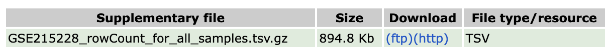
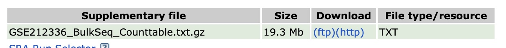

## Part 3 - Independent project work

### Analysis of bulk or single-cell RNA-seq data. 

Choose one of the following datasets and perform bulk or single-cell RNA-seq data analysis. Perform analysis using DESeq2 (bulk). The results of analysis should be contained in a single notebook and include the following:

**Dataset + experimental design description - either use comment or write narrative inside the notebook/report**
 
 - What are the groups/conditions, how many replicates, any covariates (batch, donor, sex, etc.)?
 - A clear statement of the main contrast (condition A vs condition B) tested.
 
**Basic QC**

 - Plot barplot of library sizes plot based on raw counts (colSums(counts)):
 - sample–sample correlation heatmap, or sample distance heatmap (on variance stabilized data VSD)
 - PCA analysis on variance stabilised data (VSD) and it's interpreatation
 
**Differential gene expression analysis**

 - MA plot
 - DESeq2 analysis in 3 steps
 - How many genes are up/downregulated with cutoff of padj < 0.05 and |log2FoldChange | > 2
 - Export full DE table with gene symbols as csv file
 - Volcano plot

**Visualisation**

 - Heatmap visualisation of top 50 up/down regulated genes
 - Expression plot for 2 marker genes of your choice across conditions (boxplot/violin)
 
**GO term analysis**

 - Biological process
 - Molecular function
 - Visualisation using dotplot, barplot and  optionally cnet network plot for top 10 terms

----------------------------

## Datasets to choose from 

#### [transcriptional landscapes during cerebral cortex development in a microcephaly mouse model](https://www.sciencedirect.com/science/article/abs/pii/S1673852723002230)

There is bulk RNA-seq of E17.5 and P4 mouse cortex. Perform differential gene expression in cortex between E17.5 and P4

Use function read.table() to laod the data from the GSE215228_rowCount_for_all_samples.tsv.gz	file

[Link to GEO](https://www.ncbi.nlm.nih.gov/geo/query/acc.cgi?acc=GSE215228)

#### [Atlas of the aging mouse brain reveals white matter as vulnerable foci (Bulk RNA-seq)](https://www.sciencedirect.com/science/article/pii/S009286742300805X)
 
There is 847 RNA-seq samples across 8 brain regions and multiple time points. Choose 2 regions and 2 time points and perform the analysis. Include replicates in the analysis. 
 
For example - DGE of Motor cortex and Cerebellum or comparisons between two time points -3months and 21 months. Choose one comparison that you find interesting. 
 
[link to GEO](https://www.ncbi.nlm.nih.gov/geo/query/acc.cgi?acc=GSE212336)
 
Load the data using base function read.table with parameter header=1.
 
Subselect the matrix containing GE data for all experiments for the regions and timepoints you wish to analyze. 
 

---------------------

