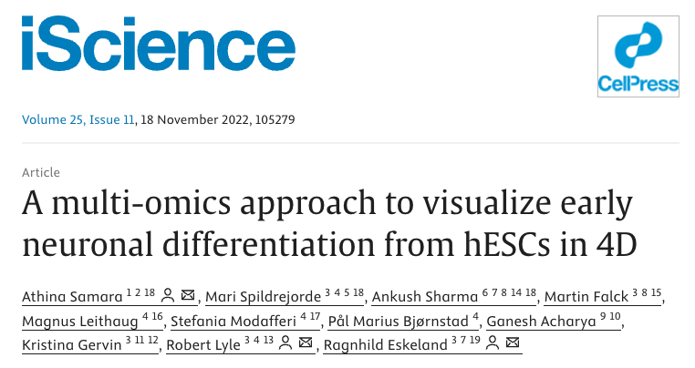
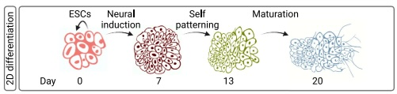
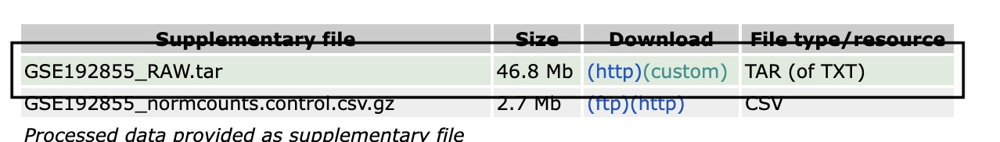
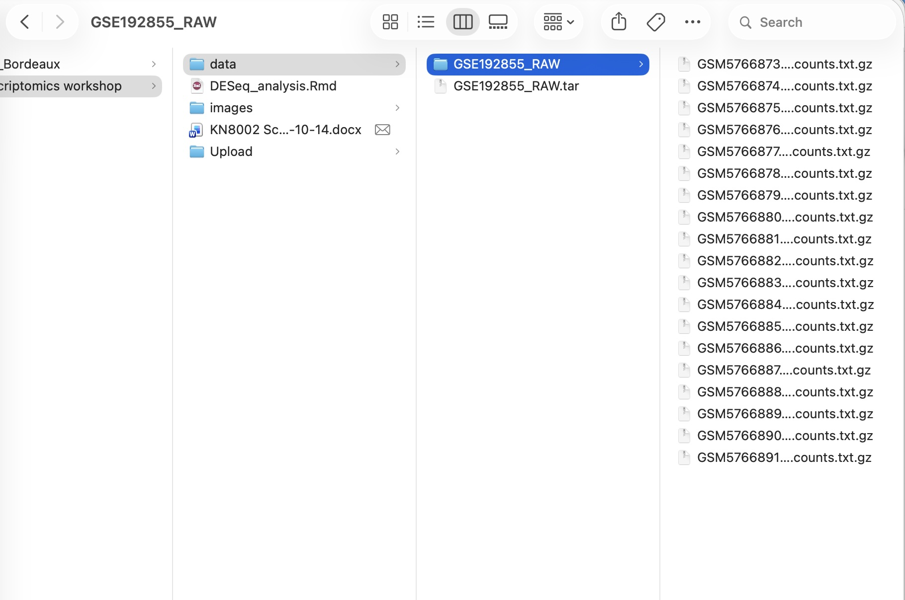
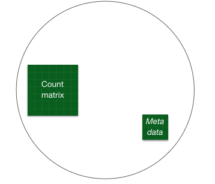
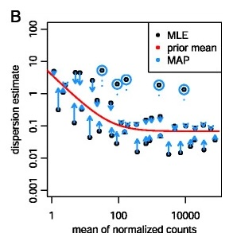
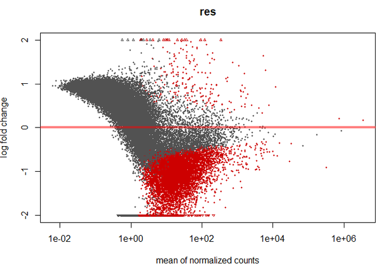
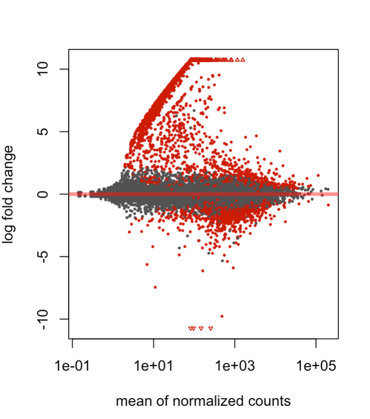

Note: For detail explanation of DESeq2 workflow refer to the full DESeq2 [vignette](https://bioconductor.org/packages/release/bioc/vignettes/DESeq2/inst/doc/DESeq2.html)


## Before you start with this vignette, read carefully these instructions

The primary goal of this transcriptomic workshop is to provide participants with a comprehensive understanding of the RNA-seq data analysis pipeline using R and Bioconductor packages such as DESeq2. You will learn about the basic concepts behind statistical analysis of transciptomic data, and be able to perform basic analysis of public RNA-seq on your own. 

Goal: run a DESeq2 bulk RNA-seq workflow on GEO dataset GSE192855.

We are going to analyse bulk RNA-seq data from this [paper](https://www.sciencedirect.com/science/article/pii/S2589004222015516) 




Data: Day 0, 7, 13, 20 of in vitro neuronal differentiation.




#### By the end of this vignette, you should be able to:

 - Perform differential expression analysis using DESeq2.
 - Generate visualizations such as PCA plots, volcano plots, and heatmaps.
 - Interpret results in the context of biological pathways and Gene Ontology (GO) terms.


#### The most common potential problems: 
In case of errors, try to figure out what is wrong with your command. Typical errors include:

- Typos 
- Your input is not what it is supposed to be (check it)
- Missing library - Google how to install a missing library. Typically use either install.pacakges() or BiocManager::install() functions
- File loading issues - Make sure to specifiy the correct path to your raw data files. 
- Wrong syntax (google it or ask chatGPT/Gemini etc)

Generally, start by googling the error and use chatGPT/Gemini... to help you. If you do not understand, you can also ask the LLM to explain to you. 

Ask Marek, Pepe or Yiquan for help and we will can also help you and explain. 


#### Prepare folder for the analysis and start notebook

1. Before starting the analysis make sure to create a new folder for the project. 

2. Create a new R notebook by going to File -> New File -> R Notebook

3. Save the notebook to the project folder. 

## Step 1.  Download the data from GEO (if already done with this, proceed to the next step)

[Link to GEO page](https://www.ncbi.nlm.nih.gov/geo/query/acc.cgi?acc=GSE192855)

[Direct link to the file](https://www.ncbi.nlm.nih.gov/geo/download/?acc=GSE192855&format=file)

Download the file "GSE192855_RAW.tar" and place it into the folder "data". Unapack the .tar archive it by right click -> extract all (Windows) or double-click (Mac OS)




------------- 
You should now see 19 files that were unpacked (one file per experiment/replicate)



### Question 1: How many timepoints? How many replicates per timepoint?

Hint: use GEO info + filenames. Can you infer replicate/timepoint from filename? [GEO page](https://www.ncbi.nlm.nih.gov/geo/query/acc.cgi?acc=GSE192855) 

## Installing required libraries

```{r, eval=FALSE}
options(repos = c(CRAN = "https://cloud.r-project.org"))

install.packages('BiocManager')

# Install through Bioconductor
BiocManager::install('DESeq2')
BiocManager::install('biomaRt')
BiocManager::install('org.Hs.eg.db')
BiocManager::install('clusterProfiler')

# Install ggrepel
install.packages('ggrepel')
install.packages('pheatmap')

```


## Step 2. Load one file and inspect it

#### To begin, we load a single file containing gene count data:

```{r}
# Load a single count file
# NOTE: you likely need to change path and/or filename

D0_rep1_table <- read.table(file='../../../data/GSE192855_RAW/GSM5766873_1-sc1-D0-ctrl-A.counts.txt.gz', header=TRUE)

head(D0_rep1_table)
```

### Question 2: Can you identify what kind of information is provided in the table we just loaded ? 

 - Which column is raw counts? 
 - Which column contains gene id information ? 

```{r,include=FALSE}
D0_rep1_counts <- D0_rep1_table[,7 ]
names(D0_rep1_counts) <- D0_rep1_table[,1 ]

head(D0_rep1_counts, 20)

```


```{r, eval=FALSE}
# TODO: pick the correct column for raw counts (hint: check the table)
D0_rep1_counts <- D0_rep1_table[, ___ ]

# TODO: choose which column contains gene IDs
names(D0_rep1_counts) <- D0_rep1_table[, ___ ]

# Review the created vector
head(D0_rep1_counts, 20)

```

## Step 3a: Loading all of the data one by one

Now we need to repeat this process of data import for all 19 files. It is possible to do it one by one (or using a loop). Choose one approach and load all the data into 19 variables called

19 variables: 

 - D0_rep1_counts
 - D0_rep2_counts
 - D0_rep3_counts
 - ...
 - D20_rep3_counts
 - D20_rep4_counts


```{r, eval=FALSE}
# Example 
D0_rep2_table         <- read.table(file='../../../data/GSE192855_RAW/GSM5766874_2-sc1-D0-ctrl-B.counts.txt.gz', header=TRUE)

# TODO fill in the correct columns of counts and gene ids
D0_rep2_counts        <- D0_rep2_table[,_] # This extracts vector of counts
names(D0_rep2_counts) <- D0_rep2_table[,_] # This extracts gene ids

# Preview the first few rows of the file
head(D0_rep2_counts,20)

# Now write the code for loading of rest of the files below
# ...
# ...
# ...
```
### Constructing the counts table 

Aggregate the data loaded into 19 variables into a single data frame


```{r,eval=FALSE}
combined_counts <- cbind(D0_rep1_counts,D0_rep2_counts, ...) # Fill in all the variable names instead of ...

# Check the structure of the final counts table
print(head(combined_counts))
```


## Alternative Step 3b: Load all the data using loop (alternative to loading one by one)

```{r,include=FALSE}
all_files <- list.files('../../../data/GSE192855_RAW/',pattern = "*counts.txt.gz",full.names = TRUE)
all_files

counts_list <- list()

for (file in all_files){
  counts_table               <- read.table(file=file,header=TRUE)
  counts_list[[file]]        <- counts_table[,7] # This extracts vector of counts
  names(counts_list[[file]]) <- counts_table[,1] # This extracts gene ids
}

lapply(counts_list,head)

# Aggregate the the data to a matrix using two commands - do.call and cbind
# This will convert list of vectors into matrix
combined_counts <- do.call('cbind',counts_list)

# Add column names to the matrix from file names
colnames(combined_counts) <- basename(names(counts_list))

# Check that the matrix looks good
head(combined_counts)

# The dimensions of the matrix should be 33694 genes (rows) by 19 samples (columns)
dim(combined_counts)

```

```{r, eval=FALSE}
# Another option: Alternatively one can use a for loop to load all the files into a list of vectors. 

# Deliberate mistakes are present below — fix them.

all_files <- list.files("data/GSE192855_RAW/",pattern = "*counts.txt.gz",full.names = TRUE) # <- (hint: is the pattern correct?)

# Peek into all_files
all_files

# Create empty list
counts_list <- list()

# For each item in all_files load the file and select the right columns
for (file in all_files){                                                                              
  counts_table               <- read.table(file=file,header=TRUE)                                    
  counts_list[[file]]        <- counts_table[,_] # This extracts vector of counts                     # <- TODO: fill in column number
  names(counts_list[[file]]) <- counts_table[,_]  # This extracts gene ids                             # <- TODO: fill in column number
}

# Quick peek
lapply(counts_list,head)

# Aggregate the the data to a matrix using two commands - do.call and cbind. This will convert list of vectors into matrix. 
combined_counts <- do.call('cbind',counts_list)

# Column names should be sample names, not full paths
colnames(combined_counts) <- basename(names(counts_list))

# Check that the matrix looks good
print(head(combined_counts))

# The dimensions of the matrix should be 33694 genes (rows) by 19 samples (columns)
dim(combined_counts)


```


### Check the structure of combined_counts table

```{r,eval=FALSE}
dim(combined_counts)
head(combined_counts)
```


```{r,echo=FALSE}
dim(combined_counts)
knitr::kable(head(combined_counts))
```

Expectation check: rows ≈ number of genes, columns = number of samples.


Count matrix is the essential input into DESeq2 analysis. Count matrix is composed of genes (rows) and samples (columns). Count matrix can be generated in different ways, this is just an example how to get there from this particular structure of data deposited in GEO.  

In addition to count matrix we wil need metadata (colData) to inform DESeq about what kind of sample we want to compare with each other and replicates. 

## Step 4. Creating Experimental Metadata 

To properly analyze RNA-seq data in DESeq2, you need to provide experimental metadata, which describes the experimental design and conditions for each sample. This includes information such as 
 - sample names
 - time points
 - any oher relevant informatoin like batch, cell line, sex or age

Below is an example of creating metadata manually:

Note: It is critical that the column names of the count matrix and row names of metadata match each other and are in the same order. E.g. column 1 of count matrix corresponds to row 1 of metadata etc. 

```{r,eval=FALSE}
# Exercise: fill the blanks using only colnames(combined_counts)
sample_id <- colnames(combined_counts)
sample_id

# TODO 1: create a timepoint vector by extracting D0/D7/D13/D20 from sample_id
# TODO 2: set rownames(coldata) to the sample IDs

timepoint <- ___                                       # TODO: Create timepoint vector e.g. c("D0","D1","D2","D3) of length 19 that matches the sample id
coldata <- data.frame(timepoint = factor(timepoint,levels = unique(timepoint)))   # Create metadata dataframe
rownames(coldata) <- ___                               # TODO: Set rownames to sample_id

# Check
stopifnot(all(rownames(coldata) == colnames(combined_counts)))
table(coldata$timepoint)
```

```{r,include=FALSE}
timepoint <- c('D0','D0','D0','D0','D0',
               'D7','D7','D7','D7','D7','D7',
               'D13','D13','D13','D13',
               'D20','D20','D20','D20')

coldata <- data.frame(timepoint = factor(timepoint,levels=unique(timepoint)))
rownames(coldata) <- colnames(combined_counts)
```


Final check: Make sure that the order of samples in columns of count matrix and rows of metadata matches. 
 - Check that colnames(combined_counts) matches coldata
```{r,eval=FALSE}
head(combined_counts)
print(coldata)
```


```{r,echo=FALSE}
knitr::kable(head(combined_counts))
knitr::kable(head(coldata))
```


To begin differential expression analysis, you need to load the DESeq2 library and construct a DESeqDataSet object, which is central to the DESeq2 pipeline. This object encapsulates the count matrix, metadata, and experimental design.

DESeq2 is part of the Bioconductor project, so you’ll need BiocManager to install it if it isn’t already available.

```{r,echo=FALSE, message=FALSE, warning=FALSE, results='hide'}
# Load the DESeq2 library
# Install it first if not already available
# Uncomment the two lines below to install DESeq2:
# install.packages('BiocManager')
# BiocManager::install("DESeq2")

library(DESeq2)
```

#### Creating a DESeq2 object

The DESeqDataSetFromMatrix() function constructs a DESeq2 dataset using:

1.	countData:
 - A matrix of raw read counts (rows are genes, columns are samples).
 - This is typically a matrix where each entry represents the raw counts for a gene in a sample.
 - Ensure that row names are gene IDs and column names match the sample names in your metadata.
2.	colData:
 - A data frame containing the experimental metadata for your samples.
 - It must have row names that correspond to the column names of the count matrix.
3.	design:
 - A formula specifying the experimental design.
 - In this case, we use ~ timepoint, meaning we want to model the effect of timepoint on gene expression.




```{r}
# Load the DESeq2 library
# Install it first if not already available
# Uncomment the two lines below to install DESeq2:
# install.packages('BiocManager')
# BiocManager::install("DESeq2")
library(DESeq2)

# Create the DESeq2 dataset
dds <- DESeqDataSetFromMatrix(countData = combined_counts,  # Raw count matrix
                              colData = coldata,            # Experimental metadata
                              design = ~timepoint)         # Experimental design formula needs to match a column name in colData


# The resulting object is a DESeqDataSet
dds
```

## Step 5. Performing DESeq2 Analysis in Three Simple Steps

The DESeq2 analysis pipeline is designed to handle RNA-seq count data efficiently. It involves three core steps: normalization, dispersion estimation, and statistical modeling/testing. Each step builds upon the previous one, so the order matters. 


#### Visualize the library sizes for each replicate (cum of counts accross experiment)

```{r}
counts_summary <- colSums(combined_counts) # Count number of reads in each library in total
counts_summary

par(mar=c(5, 15 ,1 ,1))
barplot(counts_summary,cex.names = 0.6,las=2,horiz = TRUE,main = "Read counts per replicate of bulk RNA-seq")
```

### Step 5a. Estimate size factors 

```{r}
# Estimate size factors for normalization
dds <- estimateSizeFactors(dds)
```

#### Purpose:
 - RNA-seq experiments often show differences in sequencing depth across samples, which can bias the analysis.
 - Size factors are calculated to normalize for these differences, ensuring that gene counts are comparable between samples.

#### What happens internally:
 - DESeq2 calculates size factors by estimating a scaling factor for each sample, based on the median ratio of gene counts to the geometric mean across samples.
 - The raw counts in the dataset are divided by these size factors to produce normalized counts.

This normalization step does not account for biological factors or experimental design—it purely adjusts for library size differences.


### Step 5b. Estimate the dispersion

```{r}
# Second step is to estimate the dispersion for each gene 
dds <- estimateDispersions(dds)
```

#### Purpose:
 - RNA-seq count data follows a negative binomial distribution, which requires an estimate of dispersion (variability of counts relative to the mean) for each gene.
 - Dispersion captures both biological variation and technical noise.
 - RNA-seq suffers from overdispersion (too much noise) and expression of some genes would be too noisy to do a reliable comparison
 - DESeq models dispersion and assumes genes with similar expression level also have similar dispersion (variance) - this is modeled internally in the DESeq2 package

#### What happens internally:
 - DESeq2 fits a dispersion model to the data, estimating gene-specific dispersion values.
 - These values are then shrunk toward a fitted trend line to stabilize estimates, especially for genes with low counts.




After this step, you can visualize dispersion estimates to confirm proper fitting:


```{r}
plotDispEsts(dds)

# Task: Compare the obtained dispersion ~ mean model with the expected plot in section "Dispersion plot and fitting alternatives" from vignette below:
# https://bioconductor.org/packages/3.21/bioc/vignettes/DESeq2/inst/doc/DESeq2.html 

# What is the relationship between dispersion and mean expression in general ? 


```


### Step 5c: Fit the Model and Perform Wald Test


```{r}
# Fit the negative binomial model and perform Wald test
dds <- nbinomWaldTest(dds)
```

Purpose:
 - DESeq2 fits a negative binomial generalized linear model (GLM) for each gene using the specified design formula (e.g., ~ timepoint).
 - The Wald test is used to assess the significance of coefficients (e.g., log2 fold changes for time points).

What happens internally:
 - For each gene, DESeq2 estimates:
 - Log2 fold changes (LFCs) for each level of the design factor (e.g., differences between time points).
 - Statistical significance (p-values) for the observed differences.
 - The results can later be extracted using the results() function.

Output and Next Steps

After running these steps, the dds object is updated with:
 - Normalized counts (accessible using counts(dds, normalized=TRUE)).
 - Dispersion estimates for each gene.
 - Model coefficients (log2 fold changes) and Wald test results.


Troubleshooting Tips:
1.	Size Factors:
 - If size factors are extreme, check for outlier samples or problematic genes with very high counts.
 - Use sizeFactors(dds) to inspect the calculated size factors.
2.	Dispersion Estimation:
 - Check the plot from plotDispEsts(dds) to ensure dispersions are properly fitted.
 - Extremely noisy data may require additional filtering before analysis.
3.	Model Fitting:
 - Ensure the design formula in the dds object is correct (design(dds)).
 - If results seem unexpected, check for batch effects or missing variables in the metadata.


## Step 6. QC of DESeq2 model and differential expression

### MA plot

An MA plot is a key visualization used in RNA-seq differential expression analysis, including the DESeq2 pipeline. It provides an overview of the relationship between the mean expression levels (average expression strength) and the log-fold changes (LFC) of genes between two conditions. Here’s how it is useful and what to pay attention to:

####  Purpose of the MA Plot in DESeq2

1.	Visualizing Differential Expression:
 - The MA plot shows each gene as a point, where:
 - The x-axis represents the average expression level (mean expression,  A ).
 - The y-axis represents the log2 fold change ( M ) between conditions.
 - It helps identify genes with significant changes in expression across a range of expression levels.
2.	Detecting Outliers:
 - Outliers can be easily spotted as points that are far from the main cloud of data.
3.	Quality Check:
 - You can assess whether the normalization and dispersion estimation have been properly applied.
 - Ideally, the majority of genes with low fold change should cluster near zero on the y-axis.
4.	Highlighting Significantly Altered Genes:
 - DESeq2 often marks significantly differentially expressed genes (e.g., adjusted p-value < 0.05) in color (e.g., blue).
5. Potential problems to look out for 
 - Global shifts
 - Extreme LFCs at low mean


```{r}
# Let's plot MA plot 
plotMA(dds)
```

### examples of bad MA Plots




## Step 7. Extracting and Inspecting DESeq2 Results

In this step, we extract and examine the results of the differential expression analysis for the comparison of D13 against D0 timepoints. This provides information on genes that are differentially expressed between these two time points.

1.	The results() function extracts the results table for a specific comparison from the dds object.
2.	The name argument specifies which comparison to extract. Here, "timepoint_D13_vs_D0" refers to the log2 fold changes (LFCs) for the time point D13 relative to the baseline D0.
	
```{r,eval=FALSE}
# DESeq2 considers the first condition as control - this is D0 in our case, and all comparisons are done against D0 
resultsNames(dds) # lists the contrasts/comparisons tested 

# Now we can extract data frame of results for comparison of D13 against D0
# The results contain log2FoldChange and adjusted p.value
res <- as.data.frame(results(dds, name = "___"))  # <- TODO: fill in the name of the contrast from resultsNames(dds) (Answer: timepoint_D13_vs_D0)

# We will get a table with 33694 (all) genes and 6 columns, examine it below
# For some genes expression test can't be done - e.g. if there is not counts in any of the samples or baseMean == 0.00000
head(res)
dim(res)

```

```{r,include=FALSE}
# Now we can extract data frame of results for comparison of D13 against D0
res <- as.data.frame(results(dds, name = "timepoint_D13_vs_D0"))

# We will get a table with 33694 (all) genes and 6 columns, examine it below
# For some genes expression test can't be done - e.g. if there is not counts in any of the samples or baseMean == 0.00000
head(res)
dim(res)

```


# Converting ENSG codes to gene names and adding them to the res table

```{r, eval=FALSE}
# ENSGs to gene name
library(org.Hs.eg.db) # For human gene annotations
library(AnnotationDbi)

# 1) Map Ensembl IDs (row names of res) to Gene Symbols
gene_symbols <- mapIds(
  org.Hs.eg.db,
  keys     = ___,          # TODO: rownames(res)
  keytype  = "ENSEMBL",
  column   = "SYMBOL",
  multiVals = "first"
)

# Check the conversion vector (first 20 entries)
head(gene_symbols, 50)

# Q1: How many genes did NOT map to a gene symbol (NA)?
# Hint: use is.na() and sum()
___

# 2) Add gene symbols to the results table
res$___ <- gene_symbols[rownames(res)]   # TODO: column name should be gene_name

# 3) Sort by p-value (most significant DE genes first) and keep NA p-values at the bottom
resOrdered <- res[order(is.na(res$pvalue), res$pvalue), ]
head(resOrdered, 20)
```

```{r,include=FALSE}
# ENSGs to gene name
library(biomaRt)
library(org.Hs.eg.db) # For human gene annotations
library(AnnotationDbi) 

# Map Ensembl IDs to Gene Symbols:
# The AnnotationDbi::mapIds() function is used to map Ensembl IDs to gene symbols using the org.Hs.eg.db database (for human).

gene_symbols <- mapIds(
  org.Hs.eg.db, 
  keys = rownames(res), 
  keytype = "ENSEMBL", 
  column = "SYMBOL", 
  multiVals = "first"
)


# Map Ensembl IDs to Entrez IDs
# Similarly, Ensembl IDs are mapped to Entrez IDs, which are required for many GO tools.

entrez_ids <- mapIds(
  org.Hs.eg.db, 
  keys = rownames(res), 
  keytype = "ENSEMBL", 
  column = "ENTREZID", 
  multiVals = "first"
)

# The mapped gene symbols and Entrez IDs are added as new columns to the res table.
# Intentional mismatch: indexing
res$gene_name <- gene_symbols[rownames(res)]
res$entrez    <- entrez_ids[rownames(res)]

#	Differential expression results are sorted by p-value to prioritize the most significant genes for GO analysis.
resOrdered <- res[order(is.na(res$pvalue), res$pvalue), ]
head(resOrdered, 20)
```


#### Exporting differential gene expression table into csv file and open it in excel

We can export the table with differentially expressed genes so we can share it with collaborators

```{r}
# Export data frame using write.csv function
write.csv(res,file = 'D13_D0_DEGs.csv')
```


The resulting data frame (res) contains 33,694 rows (one for each gene) and 6 columns, which include the following:

 - **baseMean**	       - The mean of normalized counts across all samples for a gene.
 - **log2FoldChange**	 - Log2 fold change for D13 vs D0 (positive values indicate upregulation in D13).
 - **lfcSE**	           - Standard error of the log2 fold change estimate.
 - **stat**	           - Wald statistic for the hypothesis test (log2 fold change significantly different from 0).
 - **pvalue**	         - Raw p-value for the test.
 - **padj**	           - Adjusted p-value using the Benjamini-Hochberg method to control the false discovery rate (FDR).

## Step 8. Creating a Volcano Plot with ggplot2

A volcano plot is a key visualization for differential expression analysis. It combines fold-change (x-axis) and statistical significance (y-axis) to highlight genes of interest.

Remember to always use p-value corrected for multiple hypothesis testing

```{r,eval=FALSE}
# Volcano plot
library(ggplot2)
library(ggrepel)

# Add a new column to mark significant genes
res$sig <- FALSE                            # Default: not significant
res$sig[res$padj < 0.05] <- TRUE            # Mark genes with padj value < 0.05 as significant

ggplot(res, aes(x = ___, y = ___, color = sig)) + # TODO: fill in log2FoldChange to the x, and -log10(padj) to y
  geom_point(size = 0.02, alpha = 0.7) +
  theme_minimal() + 
  geom_text_repel(data = res[which(res$padj < 1e-50 & abs(res$log2FoldChange) > 5), ],aes(label = gene_name)) # Used for labeling of some genes in the volcano plot

```

```{r,echo=FALSE, message=FALSE, warning=FALSE}
# Volcano plot
library(ggplot2)
library(ggrepel)

# Add a new column to mark significant genes
res$sig <- FALSE                            # Default: not significant
res$sig[res$padj < 0.05] <- TRUE            # Mark genes with padj value < 0.05 as significant

p1 <- ggplot(res, aes(x = log2FoldChange, y = -log10(padj), color = sig)) +
  geom_point(size = 0.02, alpha = 0.7) +
  theme_minimal() + 
  geom_text_repel(
    data = res[which(res$padj < 1e-50 & abs(res$log2FoldChange) > 5), ],
    aes(label = gene_name),col='black',max.overlaps = 20)

print(p1)
```


## Step 9. Principal Component Analysis (PCA) Plot with DESeq2

A PCA plot is a powerful visualization for understanding variability in RNA-seq data. It reduces high-dimensional count data into principal components (PCs) that summarize major sources of variation.

#### Variance Stabilizing Transformation (VST)

Before generating the PCA plot, we transform the raw count data to stabilize variance across the range of expression levels and obtain transformed and normalised expression values. 

```{r}
# Apply Variance Stabilizing Transformation (VST)
vsd <- vst(dds)

# Generate PCA plot using transformed and normalized data with timepoint as the grouping factor
plotPCA(vsd, intgroup = c("timepoint"))
```

Explanation:
vst():
 - Performs a variance stabilizing transformation to normalize count data.
 - Stabilizes variance, especially for genes with low counts.
 - Retains important biological differences in the data.


The transformed data should be approximated variance stabilized and also includes correction for size factors or normalization factors. The transformed data is on the log2 scale for large counts.

For more details on vst() transformation see [DESeq vignette](https://bioconductor.org/packages/3.21/bioc/vignettes/DESeq2/inst/doc/DESeq2.html)

#### Principal component analysis 

Principal Component Analysis (PCA) is a statistical method used to simplify complex data by summarizing its variation into a few dimensions called principal components (PCs). For RNA-seq, PCA helps reduce the thousands of genes into just a few components that explain the most variability in the data.

Why Use PCA in RNA-seq Analysis?
1.	Exploration of Data Structure: PCA helps identify patterns in the data, such as similarities or differences between experimental groups (e.g., time points, treatments).
2.	Quality Control: PCA can reveal outliers or unexpected clustering, which may indicate technical issues, batch effects, or biological variation.
3.	Visualization: PCA plots provide an easy way to visualize the relationships between samples in a 2D or 3D space.

How to interpret PCA plots: 
 - Samples from the same condition (e.g., same time point or treatment group) should cluster together. If they do, it suggests that the biological signal dominates the data.
 - Clear separation between clusters along a principal component indicates that the experimental condition (e.g., time point or treatment) explains a significant portion of the variation.
 - The percentage of variance explained by PC1 and PC2 is often shown on the axes. For example, if PC1 explains 50% of the variance, it means half of the differences between samples are captured along this axis.
 
Outliers - Samples that do not cluster with their group may indicate:
 - Technical issues (e.g., poor library preparation or sequencing).
 - Unique biological differences (e.g., a rare phenotype).

plotPCA():
 - Visualizes the data on a 2D plot using the first two principal components (PC1 and PC2).
 - Each point represents a sample, positioned based on its expression profile.
 

## Step 10. GO terms analysis

#### Convert ENSG names to actual gene names and to entrez ids for GO term analysis

Gene Ontology (GO) analysis is a widely used method to interpret and summarize large-scale gene expression data, such as that generated by RNA-seq. It helps identify biological themes and processes associated with differentially expressed genes (DEGs), providing insights into the underlying biology of a system or condition.

RNA-seq experiments often identify thousands of differentially expressed genes (DEGs). GO analysis helps make sense of this large dataset by:
1.	Identifying Enriched Processes:	Determines which biological processes, molecular functions, or cellular components are overrepresented among DEGs.
2.	Biological Interpretation: Links changes in gene expression to specific biological mechanisms or pathways.
3.	Hypothesis Generation: Suggests potential biological effects of experimental treatments or conditions.
4.	Data Summarization: Condenses a long list of DEGs into meaningful categories, making the results easier to communicate and understand.

Implementation: Gene Ontology (GO) term analysis requires converting gene identifiers (like Ensembl IDs) into formats that GO tools or databases understand, such as gene symbols or Entrez IDs. This block demonstrates how to prepare these mappings using the biomaRt and AnnotationDbi R packages.

##### Performing GO Term Analysis Using clusterProfiler

This code block demonstrates how to prepare a subset of significantly upregulated and downregulated genes for Gene Ontology (GO) term analysis using clusterprofiler package

clusterProfiler is a powerful R package designed for the statistical analysis and visualization of functional profiles in high-throughput data, such as RNA-seq. It is widely used for Gene Ontology (GO) term analysis, pathway enrichment, and other functional annotation tasks.

```{r,eval=FALSE}
# GO prep exercise: define up/down gene sets and visualize your thresholds
library(ggplot2)
library(clusterProfiler)
library(org.Hs.eg.db)

# We will use the DESeq2 results table 'resOrdered' (sorted by p-value).
# Task: Create two gene sets:
#   top_up   = significantly UPregulated genes
#   top_down = significantly DOWNregulated genes
#
# Criteria (edit only the blanks, not the structure):
#   - padj < 0.05
#   - log2FoldChange > 5  for up
#   - log2FoldChange < -5 for down
#
# IMPORTANT: padj can be NA, so handle NA values correctly.

# 1) How many genes have NA padj? use sum() and is.na()
___

# 2) Filter
top_up   <- resOrdered[ ___ , ]   # TODO: fill condition for upregulated genes (!is.na(res$padj) & res$log2FoldChange >5 & res$padj < 0.05)
top_down <- resOrdered[ ___ , ]   # TODO: fill condition for downregulated genes

# 3) Sanity checks
dim(resOrdered)  # Should be 33694 rows (genes)
dim(top_up)      # Should be 372 genes
dim(top_down)    # Should be 750 genes

# Q: Are the numbers reasonable or are the cutoffs too stringent/too loose ? 

# 4) Visualize the log2 fold-change distribution by histogram and show your cutoffs
ggplot(resOrdered, aes(x = ___)) +            # <- TODO: x=log2FoldChange
  geom_histogram(binwidth = 0.25) +
  geom_vline(xintercept = c(-5, 5), linetype = "dashed") +
  theme_minimal() +
  labs(title = "Distribution of log2 fold-changes (D13 vs D0)",
       x = "log2FoldChange", y = "Number of genes")

# 5) Volcano-style scatter with cutoffs
# (Use padj on y-axis; ignore NA padj rows)
ggplot(resOrdered, aes(x = ___, y = ___) +          # <- TODO: x=log2FoldChange y=-log(padj)
  geom_point(alpha = 0.3, size = 0.4, na.rm = TRUE) +
  geom_vline(xintercept = c(-5, 5), linetype = "dashed") +
  geom_hline(yintercept = -log10(0.05), linetype = "dashed") +
  theme_minimal() +
  labs(title = "Volcano-style plot with thresholds",
       x = "log2FoldChange", y = "-log10(padj)")
```

```{r,echo=FALSE, message=FALSE, warning=FALSE}
# Load Required Libraries:
library(clusterProfiler)
library(org.Hs.eg.db) # For human gene annotations

# Filter Genes for GO Analysis:
# top_up: Subset of significantly upregulated genes.
# top_down: Subset of significantly downregulated genes.

# Filtering criteria:
# log2FoldChange > 5: Large positive fold change indicates strong upregulation.
# log2FoldChange < -5: Large negative fold change indicates strong downregulation.
# padj < 0.05: Significance threshold for adjusted p-values.

top_up   <- resOrdered[!is.na(resOrdered$padj) & resOrdered$log2FoldChange > 5 & resOrdered$padj < 0.05,]
top_down <- resOrdered[!is.na(resOrdered$padj) & resOrdered$log2FoldChang < -5 & resOrdered$padj < 0.05,]

dim(resOrdered)
dim(top_up) # 372 genes
dim(top_down) # 750 genes

# Plot the histogram - cutoffs of logFC are drawn as vertical lines
ggplot(data=res) + 
  geom_histogram(aes(x=log2FoldChange),fill='grey',col='black',binwidth = 0.25) + 
  theme_minimal() + 
  geom_vline(xintercept = c(-5,5))

# Or show the cutoffs on the violin plot
ggplot(data=res) + 
  geom_point(aes(x=log2FoldChange,y=-log(padj),col=sig),size=0.2,alpha=0.5) + 
  geom_vline(xintercept=c(-5,5)) + 
  theme_minimal()
```


#### GO term analysis of upregulated genes

This block performs Gene Ontology (GO) enrichment analysis on upregulated genes between D13 and D0 and visualizes the results using dotplot and barplot. The analysis focuses on the Biological Process (BP) ontology.

```{r,fig.height=8,fig.width=6,eval=FALSE}
# 	1.	Perform GO Enrichment Analysis:
go_enrichment <- enrichGO(
  gene          = ___,  # Gene symbols for upregulated genes (top_up$gene_names)
  OrgDb         = org.Hs.eg.db,      # Annotation database for human genes
  keyType       = "SYMBOL",          # Type of input IDs (gene symbols in this case)
  ont           = "BP",              # Ontology: Biological Process (can also be "MF" or "CC")
  pAdjustMethod = "BH",              # Adjust p-values for multiple testing (Benjamini-Hochberg) - we are testing gene set against many different GO terms
  pvalueCutoff  = 0.05,              # Significance threshold for raw p-values
  qvalueCutoff  = 0.2                # Significance threshold for adjusted p-values
)

# 	2.	Visualize Enriched GO Terms:
dotplot(go_enrichment, showCategory = 20, title = "GO Biological Process")
barplot(go_enrichment, showCategory = 20, title = "GO Term Enrichment")
cnetplot(go_enrichment)

# Visualizes the top 20 enriched GO terms as dots.
# Dot Size: Represents the number of genes associated with the term (gene ratio).
# Dot Color: Reflects the significance of enrichment (adjusted p-value).
# Useful for quickly identifying terms with high enrichment scores and significance.
```


```{r,fig.height=8,fig.width=6,echo=FALSE, message=FALSE, warning=FALSE}
# 	1.	Perform GO Enrichment Analysis:
go_enrichment <- enrichGO(
  gene          = top_up$gene_name,  # Gene symbols for upregulated genes
  OrgDb         = org.Hs.eg.db,      # Annotation database for human genes
  keyType       = "SYMBOL",          # Type of input IDs (gene symbols in this case)
  ont           = "BP",              # Ontology: Biological Process (can also be "MF" or "CC")
  pAdjustMethod = "BH",              # Adjust p-values for multiple testing (Benjamini-Hochberg) - we are testing gene set against many different GO terms
  pvalueCutoff  = 0.05,              # Significance threshold for raw p-values
  qvalueCutoff  = 0.2                # Significance threshold for adjusted p-values
)

# 	2.	Visualize Enriched GO Terms:
dotplot(go_enrichment, showCategory = 20, title = "GO Biological Process")
barplot(go_enrichment, showCategory = 20, title = "GO Term Enrichment")
cnetplot(go_enrichment, showCategory = 10)

# Visualizes the top 20 enriched GO terms as dots.
# Dot Size: Represents the number of genes associated with the term (gene ratio).
# Dot Color: Reflects the significance of enrichment (adjusted p-value).
# Useful for quickly identifying terms with high enrichment scores and significance.


```
### TODO: Peroform GO term analysis of biological process (BP) for downregulated genes. Discuss which GO terms are identified as significant. 

The cnetplot function from clusterProfiler visualizes the relationship between enriched GO terms and the genes associated with them. This network-style plot helps reveal how genes are shared across multiple enriched terms, making it easier to interpret the functional connections in your data.


**What Does the Enrichment Map Show?**
1.	Nodes: Represent enriched GO terms. The size of each node may correspond to the significance (e.g., p-value) or gene count.
2.	Edges: Represent the similarity between GO terms, based on the overlap of associated genes. Thicker edges indicate greater similarity.
3.	Clusters: Terms that share many genes are grouped into clusters, highlighting functionally related processes.
4.	Colors: The color scheme can reflect the significance or another variable (e.g., fold change).

#### Molecular function GO analysis

This block performs Gene Ontology (GO) enrichment analysis, focusing on the Molecular Function (MF) ontology, which describes the biochemical activities of gene products. It then visualizes the enriched terms using dot plots and bar plots.


```{r, fig.width=6,fig.height=8,eval=FALSE}
go_enrichment_MF <- enrichGO(
  gene          = ___,               # Gene symbols for upregulated genes (top_up$gene_name)
  OrgDb         = org.Hs.eg.db,      # Annotation database for human genes
  keyType       = "SYMBOLS",          # Input gene type (here, gene symbols)
  ont           = "MF",              # GO category: Molecular Function
  pAdjustMethod = "BH",              # Adjust p-values with Benjamini-Hochberg method
  pvalueCutoff  = 0.05,              # Significance threshold for raw p-values
  qvalueCutoff  = 0.2                # Significance threshold for adjusted p-values
)

dotplot(go_enrichment_MF, showCategory = 20, title = "GO Biological Process")
barplot(go_enrichment_MF, showCategory = 20, title = "GO Term Enrichment")
cnetplot(go_enrichment_MF)

```

```{r, fig.width=6,fig.height=8,echo=FALSE, message=FALSE, warning=FALSE}
go_enrichment_MF <- enrichGO(
  gene          = top_up$gene_name,  # Gene symbols for upregulated genes
  OrgDb         = org.Hs.eg.db,      # Annotation database for human genes
  keyType       = "SYMBOL",          # Input gene type (here, gene symbols)
  ont           = "MF",              # GO category: Molecular Function
  pAdjustMethod = "BH",              # Adjust p-values with Benjamini-Hochberg method
  pvalueCutoff  = 0.05,              # Significance threshold for raw p-values
  qvalueCutoff  = 0.2                # Significance threshold for adjusted p-values
)

dotplot(go_enrichment_MF, showCategory = 20, title = "GO Biological Process")
barplot(go_enrichment_MF, showCategory = 20, title = "GO Term Enrichment")
cnetplot(go_enrichment_MF)

```


## Step 11. Heatmap visualization of  top up- and down-regulated genes using pheatmap

Heatmaps are powerful visualizations to explore gene expression patterns. This code generates a heatmap for the top 50 upregulated genes using normalized RNA-seq data. The heatmap shows the expression levels across different samples and groups them by experimental conditions.

```{r, fig.width=6,fig.height=8,eval=FALSE}
# Load the pheatmap library
library("pheatmap")

# Subset Top Genes for plotting
heatmap_genes <- head(top_up, ___) # 50 - number of genes

# Extract Normalized Data for Heatmap
# We again use variance stabilized and normalized data here - vsd object and subset it using rownames(heatmap_genes)
data_to_plot <- assay(vsd)[___,] # rownames(heatmap_genes)
head(data_to_plot)

# Annotate with Gene Names
# Replaces Ensembl gene IDs in data_to_plot with more interpretable gene symbols from the gene_symbols mapping.
rownames(data_to_plot) <- gene_symbols[rownames(data_to_plot)]

# Check how does the data look like - now it's ready for plotting
head(data_to_plot)

# Generate the Heatmap
pheatmap(___, cluster_rows=FALSE, show_rownames=TRUE,                        # data_to_plot 
         cluster_cols=FALSE,show_colnames = FALSE, annotation_col=coldata)

```


```{r, fig.width=6,fig.height=8,echo=FALSE, message=FALSE, warning=FALSE}
# Load the pheatmap library
library("pheatmap")

# Subset Top Genes for plotting
heatmap_genes <- head(top_up,50)

# Extract Normalized Data for Heatmap
# We again use variance stabilized and normalized data here - vsd object
vsd_data <- assay(vsd) # Variance stabilised data for all genes
data_to_plot <- vsd_data[rownames(heatmap_genes),]
knitr::kable(head(data_to_plot))


# Annotate with Gene Names
# Replaces Ensembl gene IDs in data_to_plot with more interpretable gene symbols from the gene_symbols mapping.
rownames(data_to_plot) <- gene_symbols[rownames(data_to_plot)]

# Check how does the data look like
knitr::kable(head(data_to_plot))

# Generate the Heatmap
pheatmap(data_to_plot, cluster_rows=FALSE, show_rownames=TRUE,
         cluster_cols=FALSE,show_colnames = FALSE, annotation_col=coldata)

```

#### Visualizing Expression Of A Single Gene (ZEB1) Across Time Points

This code snippet creates a combined boxplot and jitter plot to visualize the expression of the gene ZEB1 across different time points. This type of plot is useful for comparing gene expression levels between groups and assessing variability within each group.

For easier interpretatin of boxplot, normalized counts rather than vsd is used - normalized counts can be extracted from dds object using counts(dds,normalized=TRUE)

```{r,fig.width=4,fig.height=7,eval=FALSE}
# Extract ENSG code of ZEB1
ZEB1_ENSG <- rownames(res[which(res$gene_name == 'ZEB1'),])         # ENSG00000148516
ZEB1_ENSG

# Get expresion value for ZEB1 ENSG code
# Retrieves normalized expression values for the ZEB1 gene from the variance-stabilized dataset (vsd).
# The assay(vsd) function extracts the underlying expression matrix, and [ZEB1_ENSG, ] selects the row corresponding to ZEB1.
zeb1_expression <- assay(vsd)[___,] # ZEB1_ENSG or ENSG00000148516
print(zeb1_expression)

# Combine ZEB1 Expression with sample metadata - make sure the order of samples is the same 
zeb1_expression <- cbind(coldata,zeb1_expression)
print(zeb1_expression)

# Plot the expression using boxplot, use timepoint as variable for x axis
ggplot(data=___) +                              # zeb1_expression 
  geom_boxplot(aes(x=timepoint,y=zeb1_expression,fill=timepoint),alpha=0.2) + 
  geom_jitter(aes(x=timepoint,y=zeb1_expression,col=timepoint),size=2) + 
  theme_bw()
```


```{r,fig.width=4,fig.height=5,include=FALSE}
# Extract ENSG code of ZEB1
ZEB1_ENSG <- rownames(res[which(res$gene_name == 'ZEB1'),])         # ENSG00000148516
ZEB1_ENSG

# Get expresion value for ZEB1 ENSG code
# Retrieves normalized count values for the ZEB1 gene from the counts(dds,normalized=TRUE) function
# The counts(dds,normalized=TRUE) function extracts the underlying normalized counts matrix from dds object, and [ZEB1_ENSG, ] selects the row corresponding to ZEB1.
zeb1_expression <- counts(dds,normalized=TRUE)[ZEB1_ENSG,] 
print(zeb1_expression)

# Combine ZEB1 Expression with sample metadata - make sure the order of samples is the same 
zeb1_expression <- cbind(coldata,zeb1_expression)
print(zeb1_expression)

# Plot the expression using boxplot, use timepoint as variable for x axis
p1 <- ggplot(data=zeb1_expression) + 
  geom_boxplot(aes(x=timepoint,y=zeb1_expression,fill=timepoint),alpha=0.2) + 
  geom_jitter(aes(x=timepoint,y=zeb1_expression,col=timepoint),size=2) + 
  theme_bw()

print(p1)
```


## Step 12. Independent tasks 

Perform the following analysis independently

1.Perform differential gene expression analysis between timepoints D20 and D0. Plot volcano plot (Log2FoldChange on x axis and adjusted p-value on y axis) and export differential gene expression table as csv file.

2.Reproduce three of the boxplots in figure 2a of the [paper](https://www.sciencedirect.com/science/article/pii/S2589004222015516). Use normalised counts (output of function counts(dds,normalized=TRUE)).

3.Reproduce the heatmap in figure 2c of the [paper](https://www.sciencedirect.com/science/article/pii/S2589004222015516). Use vsd - variance stabilized data (output of vst function).

4.Focused analysis of genes related to a specific biological process or pathway

- Choose one GO term enriched in analysis of D13 vs D0 (for example: GO:0021953  Central nervous system neuron differentiation). 
- Extract the list of genes associated with the GO term from org.Hs.eg.db database or another resource 
- Extract these genes from the count matrix and visualize their expression across time points using a heatmap.
- Extract a list of the top 5 upregulated and downregulated genes in this subset.
- Write a short explanation of the trends observed.
 
5.Sample reproducibility QC (correlation + distance heatmaps). In addition to PCA, reproducibility can be assessed using sample–sample correlation and distance.
 
- Correlation: Use variance-stabilized data (vsd <- vst(dds)), compute the sample–sample Pearson correlation matrix with cor() (samples as columns), and visualize it as a heatmap.
- Euclidean distance: Using the same assay(vsd) matrix, compute Euclidean distances between samples (e.g., dist(t(assay(vsd))),method='euclidean') and visualize as a heatmap.
- Do samples cluster by timepoint? Any potential outlier? Are the results consistent with PCA analysis ? 

Note: For detail explanation of DESeq2 workflow refer to the full DESeq2 [vignette](https://bioconductor.org/packages/release/bioc/vignettes/DESeq2/inst/doc/DESeq2.html)


