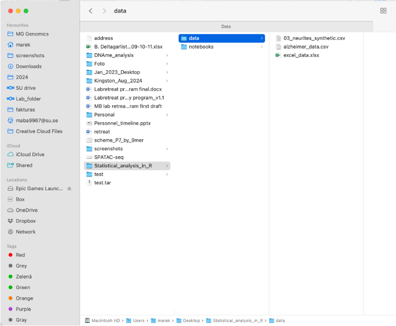
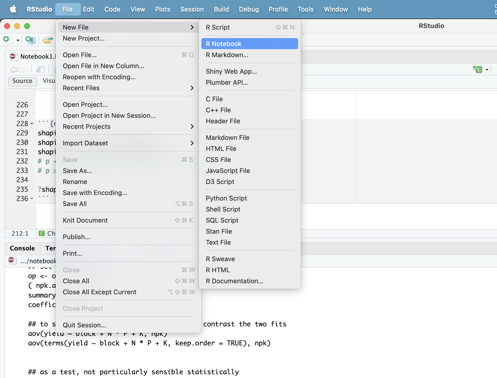
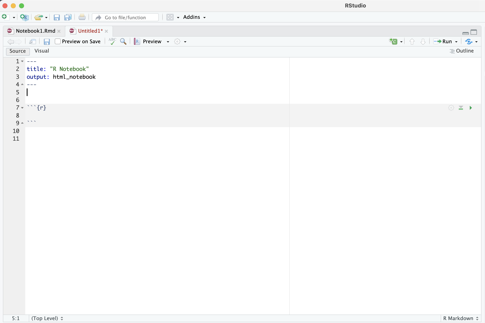

-----
title: "01. Data Import and Basics"
output:
  html_document:
-----

# KN7001 Neurochemistry with Molecular Neurobiology

R is a **free** and **open-source** programming language frequently used for **data science, statistical analysis, and data visualization**. Whether you are working with small or large datasets, R offers powerful tools for processing, analyzing and visualizing data.

R is versatile and can be applied to a wide range of tasks—from **plotting** a few data points to performing advanced analyses on **transcriptomic** and **genomic data**. In this tutorial, we will demonstrate basic usage of R for **data analysis, statistics, and visualization**.

One of R's strengths comes from its vast ecosystem of **packages** (or libraries) written by the R community. These packages make many data analysis and visualization tasks easier. Additionally, R has an active **community** and numerous forums where you can find solutions to common issues or ask questions about specific problems.

-----

# Notebook 1: Importing Data & Basics

## In this notebook you will:

 - Understand your working directory and set up a simple project.

 - Learn what vectors and data frames are in R.

 - Import a CSV file.

 - Peek at your data and compute simple summaries.
 
 - Practice subsetting (a.k.a. “slicing”) data.


-----

## Interface

Data analysis in R is typically done in an IDE (Integrated Development Environment). The most widely used IDE for R is RStudio, which can be downloaded here: [RStudio IDE](https://posit.co/products/open-source/rstudio/).


-----

### **Prerequisite:** Install both R and RStudio on your computer before proceeding.

For detailed instruction follow the guide [here](https://rstudio-education.github.io/hopr/starting.html)

-----

## Importing the data into R

### Example: Statistical Analysis of Neurite Outgrowth

Neurites are any type of projection/process from the cell body of a neuron and can be differentiated into either dendrites or axons. In this experiment, we measured neurite outgrowth in cell cultures after two different treatments with differentiation factors, along with a control group. The measurements were taken using an automated analysis pipeline, and the results were exported into a CSV file.

We will go through the steps of importing the data, performing basic quality control (QC), visualizing it, and test the data for statistical significance.

In this tutorial:
- Instructions are provided as regular text.
- Code is shown inside grey boxes, which you can copy and paste directly into your RStudio session.

**Note:** Some code blocks might require minor edits based on your file paths or environment.

```{r}
# This is a code block
# It starts with ```{r} and ends with ```
# Lines that start with "#" are comments in R. These lines are ignored when the code is executed.
```

### Seting up your first R project

   - Create an empty folder on your desktop (or any preferred location) and name it `statistical_analysis_R`.
   - Inside this folder, create two subfolders:
     - `notebooks`: to store your R scripts.
     - `data`: where you will store the CSV file you just downloaded.

**Note:** General rule for data analysis is to keep the data and code/notebooks separated in different folders.

2. **Download the data:**
   Download the  data file from the GitHub repository by clicking the [link](https://github.com/bartosovic-lab/R-teaching.github.io/tree/main/data). Download all 3 files in the folder by clicking the file and pressing download in upper right corner. 
   
3. Create a new R notebook and save it 


------

#### You should end up with the following folders and files:



#### Create notebook like this:



R notebooks allow for mixing of notes or explanations, R code and figures in a single document and are super convenient for documentation and sharing. 

You can delete lines 6-20 in the new notebook.

New, empty code chunk can be created using cmd+option+I (Mac) or ctrl+alt+I (Windows) or clicking Code -> Insert Chunk

Code chunks are highlighted in grey and contain only code. You can write notes outside of code chunks

outputs of functions or images appear below the code chunks


Now the notebook is ready to start our analysis


-----------------

### Part A — R Objects 101: Vectors & Data Frames

Understanding two core building blocks of R

#### What is a vector?

A vector is the most basic data container in R: an ordered list of values all of the same type.

Common types: numeric (e.g., 1.2), integer (e.g., 5L), logical (TRUE/FALSE), character (text), factor (categorical).

Create with c() (“combine”).

```{r}
# Numeric vector
lengths_um <- c(12.3, 15.8, 9.4, 18.1)
print(lengths_um)

# Character vector
conditions <- c("control", "condition_1", "condition_2")
print(conditions)

# Logical vector (TRUE/FALSE)
keepers <- c(TRUE, FALSE, TRUE, TRUE)
print(keepers)

# We can apply functions to vectors
length(lengths_um)      # how many elements?
class(lengths_um)       # what type?

```
#### Vectorization: apply operations to whole vectors

```{r}
# In R, most operators and many functions are *vectorized*:
# they act on every element of a vector without writing a loop.

# Example vector 
lengths_um <- c(12.3, 15.8, 9.4, 18.1)

# Elementwise arithmetic with a single number (scalar)
lengths_um + 3      # add 3 to every element
lengths_um * 5      # multiply every element by 5
lengths_um / 2      # divide every element by 2
lengths_um ^ 2      # square each element

# Elementwise arithmetic with another vector (same length)
noise <- c(0.5, -0.2, 0.0, 1.1)
lengths_um + noise
lengths_um - noise

# Recycling rule:
# If lengths are compatible (e.g., 4 and 2), R "recycles" the shorter vector.
adjust <- c(-1, +1)
lengths_um + adjust    # adds -1, +1, -1, +1 to the four elements in turn

# ⚠️ If lengths aren't multiples, R still recycles but issues a warning.
odd <- c(1, 2, 3)
lengths_um + odd       # expect a warning; avoid this pattern

# Vectorized math functions (operate on each element)
log10(lengths_um)
sqrt(lengths_um)
round(lengths_um,digits = 0)

# Vectorized summaries and cumulative ops
mean(lengths_um)               # single-number summary
cumsum(lengths_um)             # running sum
range(lengths_um)              # min and max

# Vectorized comparisons and logical operations
lengths_um > 12                # elementwise comparison → logical vector
which(lengths_um > 12)        # indices where condition is TRUE

# Plotting is also vectorised
plot(lengths_um)
```

#### What is a data frame?

A data frame is a table (rows × columns). Each column is a vector of equal length; different columns can have different types.

Think of it like an Excel sheet where:

Each column = one variable (e.g., control, condition_1, condition_2).

Each row = one observation (e.g., one well, one cell, one replicate).

```{r}
# Build a tiny data frame from vectors
df_demo <- data.frame(
  control     = c(0.45, 0.62, 0.51),
  condition_1 = c(0.60, 0.70, 0.66),
  condition_2 = c(0.80, 0.77, 0.83)
)
print(df_demo)

class(df_demo)     # "data.frame"
nrow(df_demo)      # number of rows
ncol(df_demo)      # number of columns
dim(df_demo)       # number of rows and columns (dimensions of data frame)
str(df_demo)       # compact structure
```
Access columns with $ or [, ]:

```{r}
df_demo$control           # Access column with $
df_demo[ , "control"]     # Access column with [,] and column name
df_demo[,1]               # Access column with [,] and column number

df_demo[1:2, c("control", "condition_2")]  # rows 1–2, selected columns


```
Why this matters: Many R functions expect vectors (operate on a column), while plotting and modeling functions often expect a data frame (operate on multiple columns together).

### Part B: Load & Inspect Your Data

#### Import a csv 

Before we can analyze the data, we need to import it into R and store it in the computer's memory (RAM). Once imported, we can manipulate, clean, visualize, and perform statistical analysis on the data.

```{r}
neurites <- read.csv("../../data/03_neurites_synthetic.csv")  # <-- adjust filename if needed
```

#### Check that the import went ok

```{r}
# peek at the first rows
head(neurites)

# How big is it?
nrow(neurites)
ncol(neurites)
dim(neurites)

# Column names
colnames(neurites)

# Structure (types and a preview)
str(neurites)

# Summary statistics per column
summary(neurites)
```
#### Descriptive statistics

```{r}
mean(neurites$control, na.rm = TRUE)
sd(neurites$control, na.rm = TRUE)
quantile(neurites$control, probs = c(0.25, 0.5, 0.75), na.rm = TRUE)
median(neurites$control, na.rm = TRUE)
```

Independent task: Compute the same statistics for the other 2 columns condition_1 and condition_2 

```{r}
# Your code here

```

#### Slicing (subsetting) data frames 

```{r}
# Select single columns
neurites$control
neurites$condition_1
neurites$condition_2

# Select column by column number(s)
neurites[ , 1]
neurites[ , 1:2]
neurites[ , c(1, 3)]

# Select column by it's name
neurites[,"control"]
neurites[,c("control","condition_1")]

# Student's t test of condition 1 agains condition 2
t.test(neurites$control,neurites$condition_1, alternative = 'two.sided', paired = FALSE)

# For more help on t.test parameters do 
?t.test
```

#### Subsetting data frames using logical filters

```{r}
# Logical filters (TRUE/FALSE vectors)
neurites$control > 0.5 # Vectorised logical comparison

neurites[neurites$control > 0.5, ]  # keep rows where control > 0.5

neurites[neurites$condition_1 > neurites$control & neurites$condition_2 > neurites$control,] # Keep rows where both condition_1 and condition_2 are greater than control
```

Independent task: Print neurite data frame rows where control is greater than 0.2 and condition_1 is greater than 1

```{r}
# Your code here
```


------

#### Adding new column

```{r}
neurites$delta_1 <- neurites$condition_1 - neurites$control
print(neurites)
```

----

#### More independent tasks: 

 - Use the neurites data frame you loaded earlier unless stated otherwise.
 - Tip: str(neurites), names(neurites), and head(neurites) are your friends.

1. Print column names
2. Print data frame dimensions
3. print first 6 rows
4. print column control
5. print all rows that have control value > 0.2
6. For each column calculate it's mean and standard deviation
7. Challenge: Create a logical column called "is_best2", which can be either TRUE or FALSE. Make it TRUE if value in column condition_2 is greater than value in both columns control and condition_1


### Plotting

Base R graphics are built in, lightweight, and perfect for fast exploratory plots.

#### Histograms

```{r}
# Histograms
hist(neurites$control,breaks = 10, xlab = 'control value', main = 'Distribution of control')

# Optional - overlay a density curve
d <- density(neurites$control, na.rm = TRUE)
lines(d)
```

Independent tasks: plot histograms of condition_1 and condition_2 columns of neurite data frame

#### Barplots

```{r}
# First let's calculate means of each column

mean_control <- mean(neurites$control)
mean_cond1 <- mean(neurites$condition_1)
mean_cond2 <- mean(neurites$condition_2)

# Now plot the means as a barplot
barplot(c(mean_control,mean_cond1,mean_cond2))

# Create a barplot with axis labels and color
barplot(c(mean_control,mean_cond1,mean_cond2), 
        names.arg = c('Control', 'Condition 1', 'Condition 2'),
        col = 'lightblue', 
        main = 'Mean Neurite Length by Condition',
        ylab = 'Mean Length [um]')

barplot(c(mean_control,mean_cond1,mean_cond2), 
        names.arg = c('Control', 'Condition 1', 'Condition 2'),
        col = c('lightblue', 'lightgreen', 'lightcoral'), 
        main = 'Mean Neurite Length by Condition',
        ylab = 'Mean Length [um]')

 


```
#### Saving a plot as pdf

```{r}
# Open a PDF file to save the plot
pdf(file = 'Neurites_plot.pdf', width = 6, height = 4)


# Create the same barplot inside the PDF file
barplot(c(mean_control, mean_cond1, mean_cond2), 
        names.arg = c('Control', 'Condition 1', 'Condition 2'),
        col = 'lightblue', 
        main = 'Mean Neurite Length by Condition', 
        ylab = 'Mean Length [um]')


# Close the PDF device to finish saving the plot
dev.off()
```

#### Boxlplot (box and whisker plot)

```{r}
# Boxplot to compare the groups/columns
boxplot(neurites) # neurites is a data frame - each column is one group on x axis
```

Independent task: plot only 3 columns from neurites data.frame - control, condition_1 and condition_2


## Homework - independent tasks

Perhaps you may need to google a bit to solve these tasks.

1. Create vector v <- c(1, "2", 3); check class(v). Convert it to a numeric  vector.
2. Compute the mean of vector c(1.15, 1.17, 0.83, NA, 1.43, 0.58) with and without na.rm=TRUE. Explain the difference.
3. Rename columns condition_1 → cond1, condition_2 → cond2 using names().
4. Print rows 10–15 and only columns control and cond2 of neurites data frame.
5. Add logical column is_high_cond2 which will be TRUE if the value in column cond2 is greater than median of the whole column cond2, and FALSE if it is less than the median. 
6. Create a vector log_control which is logarithm of neurites$control and plot its histogram.
7. Which row has the largest cond1? Print that row.
8. Count how many rows have cond2 > control.


