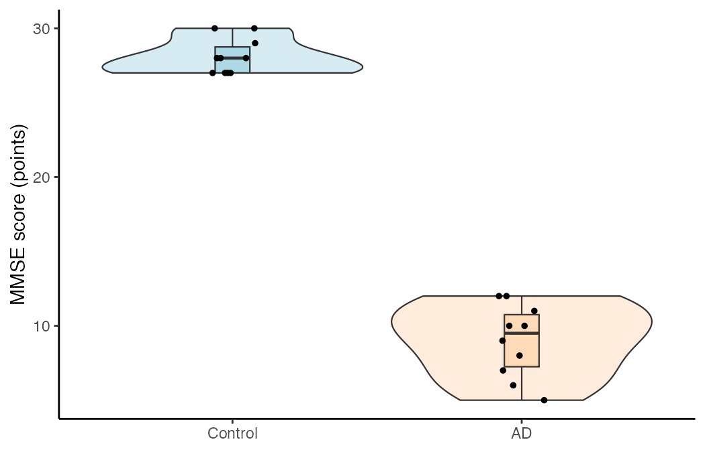

[Course index](../index.html) · [Previous: basics](01_import_basics.html) · [Next: statistical analysis](03_statistical_analysis.html)

# Day 1 — what can we see before running a test?

**Your name:** write here.

Use about **20 minutes** for this notebook. We will make histograms and boxplots, then look at a violin plot together. The code is supplied so we can spend our time understanding the figures. We will practise scatterplots at the end of notebook 3 and on day 2.

## Setup and import

Each notebook imports its own data. It should work even if the previous notebook has not been run.

```{r setup, include=FALSE}
project_root <- normalizePath(if (file.exists("Statistics_lab.Rproj")) "." else "..",
                              mustWork = TRUE)
stopifnot(file.exists(file.path(project_root, "Statistics_lab.Rproj")))
knitr::opts_knit$set(root.dir = project_root)
knitr::opts_chunk$set(echo = TRUE, error = FALSE, fig.width = 7, fig.height = 4.5)
```

```{r import}
small <- read.csv("data/mmse_small.csv")
small$Group <- factor(small$Group, levels = c("Control", "AD"))
control <- small$MMSE[small$Group == "Control"]
ad <- small$MMSE[small$Group == "AD"]
```

`factor()` tells R that `Group` is categorical. The `levels` argument sets the order in plots. It does not turn the categories into a numerical measurement.

## 1. Histograms

A histogram divides the measurement scale into intervals, or **bins**, and counts observations in each interval. Adjacent bars describe one numeric scale. This differs from a bar chart of separate categories.

```{r histograms, fig.height=3.8}
par(mfrow = c(1, 2))
hist(control, breaks = seq(-0.5, 30.5, by = 1),
     xlim = c(0, 31), ylim = c(0, 5), col = "lightblue",
     main = "Control", xlab = "MMSE score (points)")
hist(ad, breaks = seq(-0.5, 30.5, by = 1),
     xlim = c(0, 31), ylim = c(0, 5), col = "peachpuff",
     main = "AD", xlab = "MMSE score (points)")
par(mfrow = c(1, 1))
```

`par(mfrow = c(1, 2))` creates one row of two plots. The last line returns to one plot. `seq()` makes the sequence of bin boundaries; here, one bin per possible integer score. Both panels use the same axes and bins.

### Exercise 1

1. Describe the centre and spread of each group. Does either group approach the maximum possible score?
2. Copy the AD histogram command below and change its breaks to `seq(-0.5, 31.5, by = 4)`. How does the appearance change?
3. Did changing the bins change any observations? Can ten values tell you precisely what the population distribution looks like?

```{r exercise-bins}
# Copy the AD histogram command here and change the breaks.
```

**Your interpretation:**

## 2. Boxplots and individual observations

The line inside a box is the median. The box spans the lower and upper hinges, which are close to the first and third quartiles. For small datasets, these may differ slightly from the default `quantile()` calculation.

In R's default boxplot, whiskers reach the most extreme observations within 1.5 IQR of the hinges. Values beyond the whiskers are plotted separately. These are observations to inspect, not observations to automatically delete.

```{r box-and-points}
boxplot(MMSE ~ Group, data = small,
        col = c("lightblue", "peachpuff"), ylim = c(0, 31),
        outline = FALSE, ylab = "MMSE score (points)",
        main = "Ten observations per group")
set.seed(7)
stripchart(MMSE ~ Group, data = small, vertical = TRUE,
           method = "jitter", jitter = 0.12, add = TRUE, pch = 16)
```

`MMSE ~ Group` reads as “MMSE by group”. `stripchart()` adds the observations. Jitter moves points slightly sideways so repeated scores are visible; it does not change their vertical values. `set.seed()` makes that sideways movement reproducible. `outline = FALSE` prevents extreme observations being drawn twice, because we add **all** points ourselves.

### Exercise 2

1. Find the median and the middle half of the observations in each group.
2. Why is it helpful to show the points when there are only ten observations per group?
3. Does the box represent a confidence interval for the mean?

**Your answers:**

### Compare with a mean-only bar chart

```{r mean-bars}
barplot(c(mean(control), mean(ad)), names.arg = c("Control", "AD"),
        ylim = c(0, 31), col = c("lightblue", "peachpuff"),
        ylab = "Mean MMSE score (points)", main = "Only the means")
```

**Discuss:** What information did we lose? Would this chart tell us whether all AD observations were similar or whether a few very low scores pulled the mean down?

**Your answer:**

## 3. Violin plots — instructor demonstration

A violin is a smoothed estimate of a distribution, mirrored around its centre. Wider parts indicate higher estimated density. Width is not a confidence interval. These violins use equal maximum widths, so their widths do not compare group sample sizes.



The figure above is supplied. You do not need to run the following code. It is included if you want to see how the instructor made it; it requires `ggplot2`.

```{r violin-demo, eval=FALSE}
library(ggplot2)
ggplot(small, aes(x = Group, y = MMSE, fill = Group)) +
  geom_violin(trim = TRUE, scale = "width", alpha = 0.5) +
  geom_boxplot(width = 0.12, outlier.shape = NA) +
  geom_point(position = position_jitter(width = 0.08, height = 0, seed = 7)) +
  scale_fill_manual(values = c("lightblue", "peachpuff")) +
  labs(x = NULL, y = "MMSE score (points)") +
  theme_classic() +
  theme(legend.position = "none")
```

**Discuss together:** The scores are integers, but the violin is smooth. Where does that smooth shape come from? Is a detailed-looking curve strong evidence about the distribution when there are only ten observations?

Here the violin is trimmed to each group's observed range. Smoothing still suggests values between actual integer scores. Always look at the points as well. See the [ggplot2 violin documentation](https://ggplot2.tidyverse.org/reference/geom_violin.html) for the plotting settings.

**One sentence about what the violin adds, and one limitation:**

## Before we continue

Choose the figure you would use to describe this small dataset and explain why. Include a caption naming the measurements, groups, and sample sizes. Keep axis labels and units; colour changes can wait.

**Your choice and caption:**

## Extra: plots you may use in other biology courses

| Question | Useful plot | Check before interpreting |
|---|---|---|
| How variable are protein measurements in a small experiment? | Dot/strip plot | Show independent replicates, not just repeated measurements of one sample |
| How did the same cultures change after treatment? | Paired points connected by lines | Connect only measurements from the same experimental unit |
| How does a response change over time? | Time-course plot | Distinguish individual trajectories from a group average |
| How large are several estimated treatment effects? | Effect estimates with confidence intervals | Label the effect units and what the intervals represent |
| How does response change with concentration? | Dose–response plot | Inspect the concentration scale; curve fitting comes later |
| Which genes or proteins show similar patterns? | Heatmap | Read the colour key and check whether each row was scaled |

[Continue to notebook 3: normality and statistical tests](03_statistical_analysis.html)
