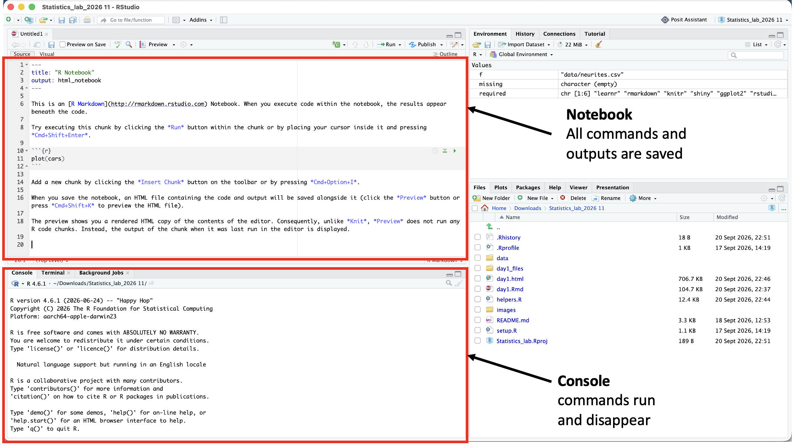

# Day 2 · MMSE dementia investigation

[← Back to KN7001](KN7001.md)

**What is this?** An afternoon of increasingly independent analysis. You work
individually on a real dementia dataset (demographics, MMSE cognitive scores,
clinical ratings and brain-volume measures), using the workflow from Day 1: state
the question, check what one row represents, look at the data, choose and
justify an analysis, interpret the result and its limitations. Discussing the
questions in groups is permitted, but each of you writes your own R Markdown
notebook with code, figures and explanations, and knits it to HTML for submission.

## Before you start

**[⬇ Download the Day 2 project (zip, < 100 kB)](../Notebooks/Statistics_lab_2026_day2.zip)**,
unzip it, and keep the folder `Statistics_lab_2026_day2` together. Then
double-click `Statistics_lab_day2.Rproj` and open `day2_mmse_tasks.Rmd` from the
Files pane. The first chunk imports the data; run it with its green triangle.

Keep the Day 1 tutorial within reach: the decision worksheet (Mission 5), the
Bonferroni example (Mission 7) and the command card are your references.

**[All 32 tasks as a web page](KN7001_day2_tasks.md)** (the same questions as in
the notebook, for reading on a phone or a second screen), or
[the notebook itself, knitted](../Notebooks/Statistics_lab_2026_day2/day2_mmse_tasks.html).

## Working in RStudio today

Yesterday the tutorial ran in a browser window and hid RStudio from you. Today
you work in RStudio itself, the way you will for your own projects. It has four
panes; the two on the left are where everything happens.

| Pane | What it is | What is saved |
|---|---|---|
| **Notebook** (top left, the editor) | Your `day2_mmse_tasks.Rmd` file: text, grey code chunks, and the output of each chunk below it | Everything. The file on disk, and the HTML you knit from it |
| **Console** (bottom left, the `>` prompt) | A place to run one command and see its result | Nothing. When R restarts, it is gone |
| Environment (top right) | The objects R currently holds in memory (`mmse`, your vectors) | Nothing; rebuilt by running your code |
| Files / Plots / Help (bottom right) | The project folder, the last plots, documentation | – |

### Console or notebook?

The **Console** is a scratchpad. Use it for things you will not need again:
a quick look at the data (`head(mmse)`, `table(mmse$Group)`), reading a help
page (`?t.test`), trying a command to see whether it works before you commit to
it, installing a package. Type, press Enter, read, move on.

The **notebook** is the record. Everything that is part of your answer goes into
it: the import, every calculation, every plot, and, as ordinary text between the
chunks, your explanation of what the result means. The rule of thumb: *if you
would want it tomorrow, it goes in the notebook.* When you find yourself running
the same Console command a second time, that command belongs in a chunk.

### Why bother with the notebook?

- **It is the analysis.** Code, output and interpretation sit in one document, in
  order. A reader (your future self, a supervisor, a reviewer) can follow what was
  done and why without guessing.
- **It can be re-run.** Change the data file, re-knit, and every number and figure
  updates. Compare with a spreadsheet, where nobody can say afterwards which cells
  were clicked in which order.
- **It catches mistakes early.** Knitting runs the whole notebook from a clean
  start, top to bottom. A chunk that only worked because of something you once
  typed in the Console will fail here, which is exactly what you want to know
  before you submit.
- **It is what you hand in.** The knitted HTML is your report; there is no
  separate write-up.

### Working in the notebook

- **Insert a chunk** under a question: *Code → Insert Chunk*, or Ctrl/Cmd+Alt+I.
- **Run a chunk**: the green triangle at its top right, or Ctrl/Cmd+Shift+Enter
  with the cursor inside it. Output appears directly below the chunk.
- **Run one line**: Ctrl/Cmd+Enter on that line.
- **Write your explanation** as plain text under the chunk, not as a comment
  inside it.
- **Knit** (the Knit button, or Ctrl/Cmd+Shift+K) regularly, not just at the end,
  so a problem shows up while it is still small.

### When something goes wrong

| What you see | What it means | What to do |
|---|---|---|
| `Error: object 'mmse' not found` | The chunk that creates the object has not been run in this session | Run the chunks above it, from the top (*Run → Run All Chunks Above*) |
| The Console prompt is `+` instead of `>` and nothing responds | A command is unfinished, usually a missing bracket or quote | Press **Esc** in the Console, then type the complete command |
| Chunks run fine but Knit fails | Knitting starts from an empty session; something your chunks rely on was only ever typed in the Console | Put that command in a chunk; then *Session → Restart R* and *Run All* to reproduce the failure and fix it |
| A plot appears in the Console area instead of under the chunk | The command was run in the Console | Run it from the chunk instead |

<!-- command-card:start -->

### Command card

Everything you need for today's questions, copied from the Day 1 tutorial. `d`, `x`, `y` and `g` are placeholders
for your own objects. Entries marked **(new)** did not appear on the Day 1 card.

| Need | Pattern |
|---|---|
| Store values | `x <- c(27, 28, 30)` |
| Import | `d <- read.csv("data/alzheimer_data.csv", header = TRUE)` |
| First look | `head(d)`; `dim(d)`; `nrow(d)`; `ncol(d)`; `names(d)`; `str(d)`; `summary(d)` |
| What type is a column? | `class(d$Age)`; `str(d)` |
| Distinct values of a column | `unique(d$CDR)` **(new)** |
| One column / one group | `d$MMSE`; `d$MMSE[d$Group == "Demented"]` |
| Rows and columns | `d[rows, cols]`; `d[d$MMSE < 20, ]`; `d[d$Group == "Demented" & d$sex == "M", ]` |
| Counts | `table(d$Group)`; `table(d$sex, d$Group)` |
| Missing values | `sum(is.na(d$SES))`; `colSums(is.na(d))` **(new)**; `mean(x, na.rm = TRUE)`; `x[!is.na(x)]` |
| Add a column | `d$is_senior <- d$Age > 80` |
| Summaries | `mean(x)`; `median(x)`; `sd(x)`; `min(x)`; `max(x)`; `range(x)` **(new)**; `quantile(x)`; `IQR(x)` |
| Round a number | `round(x, digits = 2)` **(new)** |
| Summaries per group | `tapply(d$Age, d$Group, mean)`; `tapply(d$Age, d$Group, sd)` |
| Every column at once | `sapply(d, class)`; `sapply(d, mean)` |
| The row with the highest / lowest value | `d[which.min(d$MMSE), ]`; `d[which.max(d$MMSE), ]` **(new)** |
| Distribution plots | `hist(x)`; `boxplot(y ~ g, data = d)`; `stripchart(y ~ g, data = d, vertical = TRUE, method = "jitter", add = TRUE, pch = 16)` |
| Bar chart of group means | `barplot(tapply(d$MMSE, d$Group, mean))` **(new)** |
| Scatterplot | `plot(d$nWBV, d$MMSE, pch = 16)` |
| Colour points by group | `col = c("red", "blue")[factor(d$Group)]` **(new)** |
| Add a legend | `legend("topright", legend = levels(factor(d$Group)), col = c("red", "blue"), pch = 16)` **(new)** |
| Several plots in one window | `par(mfrow = c(2, 2))` **(new)** |
| Normality evidence | `qqnorm(x); qqline(x)`; `shapiro.test(x)` |
| Two groups, two vectors | `t.test(x, y)`; `wilcox.test(x, y, exact = FALSE)` |
| Two groups, one column + one grouping column | `t.test(MMSE ~ Group, data = d)`; `wilcox.test(MMSE ~ Group, data = d)` **(new)** |
| Paired | `t.test(after, before, paired = TRUE)` |
| More than two groups | `oneway.test(y ~ g, data = d)`; `kruskal.test(y ~ g, data = d)` |
| Association | `cor.test(x, y, method = "pearson")`; `cor.test(x, y, method = "spearman", exact = FALSE)` |
| Categories | `table(a, b)`; `chisq.test(counts)`; `chisq.test(counts)$expected`; `fisher.test(counts)` |
| Pull one number out of a test | `t.test(x, y)$p.value`; `$conf.int`; `$estimate` |
| Multiple testing | `p.adjust(p_values, method = "bonferroni")` |
| ggplot version | `ggplot(d, aes(nWBV, MMSE, colour = Group)) + geom_point()` |

<!-- command-card:end -->

## During the day

Answer each question below its heading in `day2_mmse_tasks.Rmd`: code in grey
chunks, your explanation as ordinary text. Knit regularly, so that a problem
shows up early rather than at the deadline.

## Submit your work

At the end of the day: put your name in the `author:` line, **Session → Restart R**,
click **Knit**, check the resulting `day2_mmse_tasks.html`, and upload that HTML
file to **Canvas**.

## What is in the download

The zip unpacks to one folder, `Statistics_lab_2026_day2`:

| File | What it is |
|---|---|
| `Statistics_lab_day2.Rproj` | The RStudio project. Double-click this first |
| `day2_mmse_tasks.Rmd` | Your notebook with the 32 questions. This is the file you knit and submit |
| `data/alzheimer_data.csv` | The dementia dataset (336 MRI visits, 11 variables) |
| `data/README.md` | What every column means and where the data come from |
